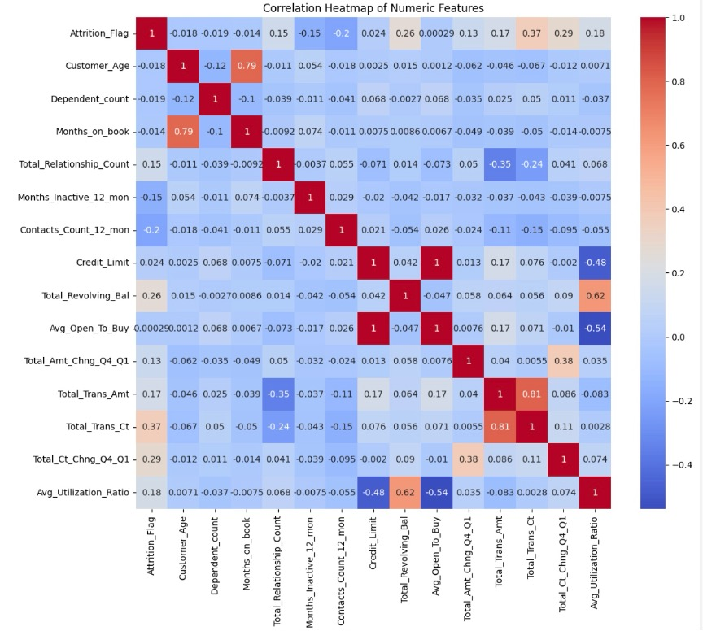
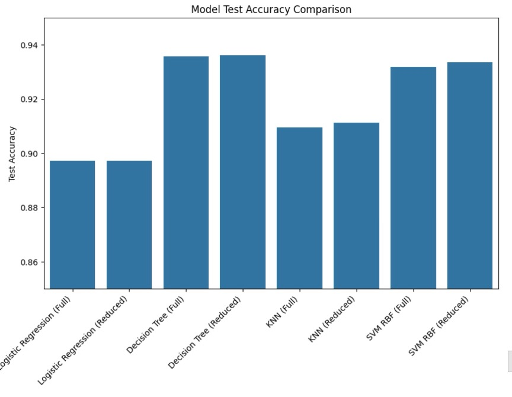
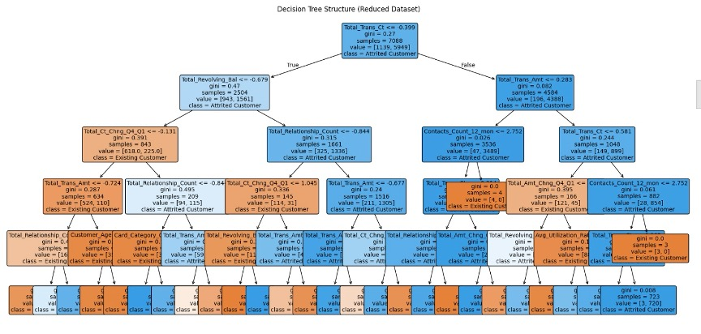

# Credit Card Customer Attrition Prediction

## Project Overview
This capstone project focuses on developing a data-driven approach to predict customer churn within a financial services dataset of **10,127 records**. By identifying "at-risk" users before they leave, the model provides a framework for targeted retention strategies and revenue protection.

## Technical Approach
* **Data Engineering:** Developed a pipeline in **Python (Pandas, Scikit-Learn)** to handle categorical encoding and feature scaling.
* **Feature Selection:** Identified and removed redundant variables, such as `Avg_Open_To_Buy`, which had a perfect correlation ($r = 1.0$) with `Credit_Limit`.
* **Machine Learning:** Evaluated and compared four supervised models: **Logistic Regression, Decision Tree, K-Nearest Neighbors (KNN), and Support Vector Machine (SVM) with an RBF kernel**.

*Caption: Pearson correlation analysis used to identify redundant features and leading indicators of churn.*

## Key Results
* **Top Performance:** The **Decision Tree** model achieved the highest test accuracy of **93.6%** on the reduced dataset.
* **Model Robustness:** The **SVM (RBF Kernel)** demonstrated superior class separation with high **AUC-ROC** values, proving its effectiveness at distinguishing between churners and non-churners.
* **Optimization:** Implemented a `max_depth=5` pruning strategy for the Decision Tree to effectively control overfitting and ensure high generalization on unseen data.

*Caption: Performance comparison across the four evaluated machine learning algorithms.*

## Summary of Performance Trend
A critical part of this study was observing how the models behaved when switching from a Full Dataset to a Reduced Dataset (engineered to remove multicollinearity).

| Model | Full Dataset Accuracy | Reduced Dataset Accuracy | Trend |
| :--- | :--- | :--- | :--- |
| **Logistic Regression** | 89.44% | 89.59% | Stable/Slight Increase |
| **Decision Tree** | 93.45% | **93.60%** | **Peak Performance** |
| **KNN** | 89.24% | 88.99% | Stable |
| **SVM (RBF)** | 93.35% | 93.35% | Consistent |

**Analysis:** The consistency in results across both datasets proves that the feature selection process was successful. We maintained (and in the case of the Decision Tree, improved) accuracy while creating a more efficient, "lighter" model.

## Business Recommendations
1. **Targeted Intervention:** Use the model to identify the "at-risk" segment for personalized outreach and retention offers.
2. **Behavioral Monitoring:** Track **Total Transaction Count** and **Total Revolving Balance**, as the model identified these as the strongest predictors of attrition.
3. **Strategic Efficiency:** Deploy the model using the **Reduced Feature Set** to reduce computational costs without sacrificing predictive power.

*Caption: Visualization of the Decision Tree logic used to classify at-risk customers.*

# Credit Card Customer Attrition Prediction

## Project Overview
[cite_start]This capstone project focuses on developing a data-driven approach to predict customer churn within a financial services dataset of **10,127 records**[cite: 151]. [cite_start]By identifying "at-risk" users before they leave, the model provides a framework for targeted retention strategies and revenue protection[cite: 135].

## Technical Approach
* [cite_start]**Data Engineering:** Developed a pipeline in **Python** to handle categorical encoding and feature scaling[cite: 143, 173].
* [cite_start]**Feature Selection:** Identified and removed redundant variables, such as `Avg_Open_To_Buy`, which had a perfect correlation ($r = 1.0$) with `Credit_Limit`[cite: 175].
* [cite_start]**Machine Learning:** Evaluated and compared four supervised models: **Logistic Regression, Decision Tree, K-Nearest Neighbors (KNN), and Support Vector Machine (SVM)**[cite: 177].

[cite_start]*Caption: Pearson correlation analysis used to identify redundant features and leading indicators of churn[cite: 174].*

## Key Results
* [cite_start]**Top Performance:** The **Decision Tree** model achieved the highest test accuracy of **93.6%** on the reduced dataset[cite: 202, 223].
* [cite_start]**Model Robustness:** The **SVM (RBF Kernel)** demonstrated superior class separation with an **AUC-ROC of 0.96**, proving highly effective at distinguishing churners[cite: 212, 213].
* [cite_start]**Optimization:** Implemented a `max_depth=5` pruning strategy for the Decision Tree to effectively control overfitting[cite: 204].

[cite_start]*Caption: Performance comparison across the four evaluated machine learning algorithms[cite: 215].*

## Summary of Performance Trend
[cite_start]A critical part of this study was observing how model performance changed when switching from a Full Dataset to a Reduced Dataset engineered to remove multicollinearity[cite: 222, 235].

| Model | Full Dataset Accuracy | Reduced Dataset Accuracy | Trend |
| :--- | :--- | :--- | :--- |
| **Logistic Regression** | 89.7% | 89.7% | [cite_start]Stable [cite: 223] |
| **Decision Tree** | 93.6% | **93.6%** | [cite_start]**Peak Performance** [cite: 223] |
| **KNN (k = 6)** | 90.9% | 91.1% | [cite_start]Slight Increase [cite: 223] |
| **SVM (RBF Kernel)** | 93.19% | 93.35% | [cite_start]Stable/Consistent [cite: 223] |

[cite_start]**Analysis:** The consistency in results across both datasets confirms that removing redundant features enhanced model efficiency without sacrificing predictive power[cite: 236].

## Business Recommendations
1. [cite_start]**Targeted Intervention:** Use the model to identify the "at-risk" segment for personalized outreach and retention offers[cite: 165].
2. [cite_start]**Behavioral Monitoring:** Track **Total Transaction Count** and **Total Revolving Balance**, as these were identified as the strongest predictors of attrition[cite: 205, 240].
3. [cite_start]**Strategic Efficiency:** Deploy the model using the **Reduced Feature Set** to reduce computational costs while maintaining high accuracy[cite: 236].

[cite_start]*Caption: Visualization of the Decision Tree logic used to classify at-risk customers[cite: 205].*

## Tools Used
* [cite_start]**Languages:** Python (Pandas, Scikit-Learn, NumPy) [cite: 143, 173]
* [cite_start]**Techniques:** Predictive Modeling, Feature Engineering, Multi-collinearity Analysis, Model Evaluation (AUC-ROC) [cite: 168, 174, 189]
* [cite_start]**Environment:** Enginius / Jupyter Notebook [cite: 184, 187]

## Tools Used
* **Languages:** Python (Pandas, Scikit-Learn, NumPy)
* **Techniques:** Predictive Modeling, Feature Engineering, Multi-collinearity Analysis, Model Evaluation (AUC-ROC)
* **Environment:** Enginius / Jupyter Notebook
